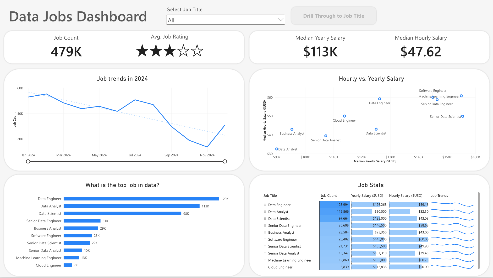
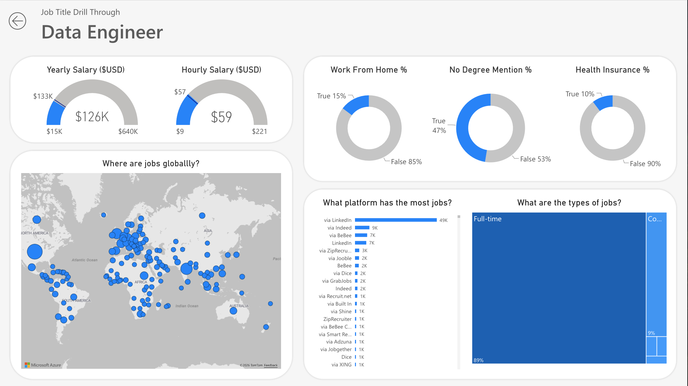

# Data Jobs Dashboard with Power BI

This Power BI dashboard was created to explore the job market trends across data-related roles in 2024. 

I built it using real-world job posting data as a part of my learning journey with Power BI and data anlytics.

## Skills Showcased

- 📒 **Power BI:** Built an interactive dashboard using real-wrold data.
- 📊 **Data Vsualization:** Uitlized core charts to effectively communicate job market metrics and trends.
- 🖌️ **Dashboard Design:** Designed clean and intuitive page layouts.
- ⭐ **Interactive reporting:** Configured slicers, buttons, chart interactions, and drill-through.

## Dashboard Overview

*This report is split into two distinct pages to provide both a high-level summary and a more detailed role-specific analysis.*

### Page 1: High-Level Market View

The first page provides an overview of the job market trends showasing key KPIs such as total job count, median salaries, and top data roles. 

### Page 2: Job Title Drill Through

The second page provides a more detailed view of an individual data role. Users can drill through from the main dashboard to explore specific details, including salary ranges, work-from-home stats, top hiring platforms, and a global map of job locations.

